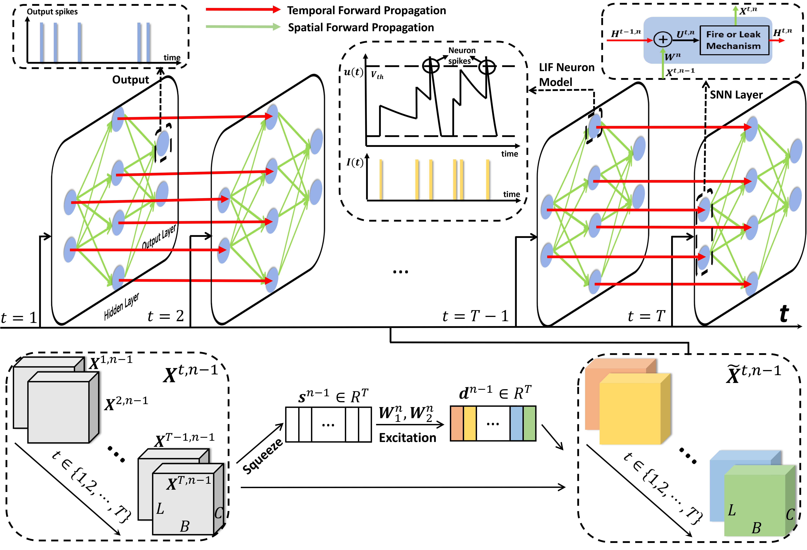
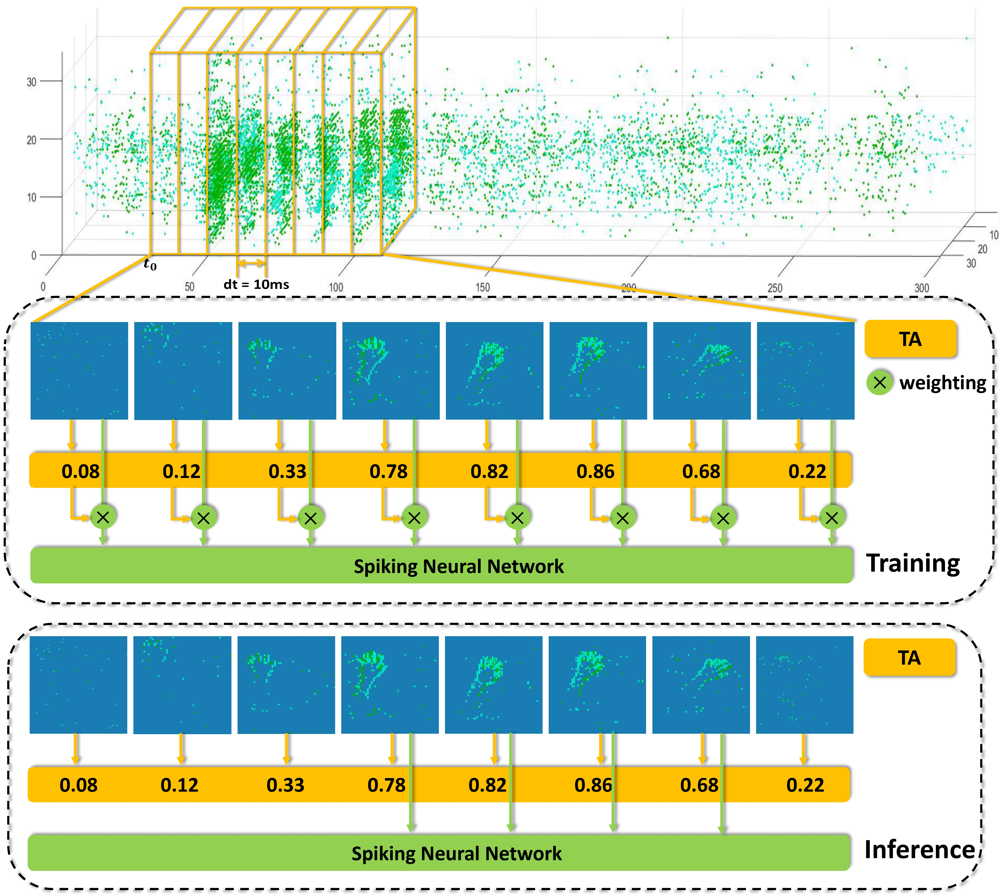

# [Temporal-wise Attention Spiking Neural Networks for Event Streams Classification](https://openaccess.thecvf.com/content/ICCV2021/html/Yao_Temporal-Wise_Attention_Spiking_Neural_Networks_for_Event_Streams_Classification_ICCV_2021_paper.html)

## Introduction

How to effectively and efficiently deal with spatio-temporal event streams, where the events are generally sparse and non-uniform and have the us temporal resolution, is of great value and has various real-life applications. Spiking neural network (SNN), as one of the brain-inspired event-triggered computing models, has the potential to extract effective spatio-temporal features from the event streams. However, when aggregating individual events into frames with a new higher temporal resolution, existing SNN models do not attach importance to that the serial frames have different signal-to-noise ratios since event streams are sparse and non-uniform. This situation interferes with the performance of existing SNNs. In this work, we propose a temporal-wise attention SNN (TA-SNN) model to learn frame-based representation for processing event streams. Concretely, we extend the attention concept to temporal-wise input to judge the significance of frames for the final decision at the training stage, and discard the irrelevant frames at the inference stage. We demonstrate that TA-SNN models improve the accuracy of event streams classification tasks. We also study the impact of multiple-scale temporal resolutions for frame-based representation. Our approach is tested on three different classification tasks: gesture recognition, image classification, and spoken digit recognition. We report the state-of-the-art results on these tasks, and get the essential improvement of accuracy (almost 19%) for gesture recognition with only 60 ms.

### TA-SNN model :


### Event Attention core :


### **Configuration requirements**
1. Python 3.7.4
2. PyTorch 1.7.1
3. tqdm 4.56.0
4. numpy 1.19.2


### **Instructions**
#### 1. DVS128 Gesture
1. Download [DVS128 Gesture](https://www.research.ibm.com/dvsgesture/) and put the downloaded dataset to /DVSGestures/data, then run /DVSGestures/data/DVS_Gesture.py.
```
TA_SNN
├── /DVSGestures/
│  ├── /data/
│  │  ├── DVS_Gesture.py
│  │  └── DvsGesture.tar.gz
```
2. Change the values of T and dt in /DVSGestures/CNN/Config.py or /DVSGestures/CNN_10clips/Config.py then run the tasks in /DVSGestures.

eg:
```
python SNN_CNN.py
```
3. View the results in /DVSGestures/CNN/Result/ or /DVSGestures/CNN_10clips/Result/.


#### 2. CIFAR10-DVS
1. Download [CIFAR10-DVS](https://figshare.com/articles/dataset/CIFAR10-DVS_New/4724671/2) and processing dataset using official matlab program, then put the result to /CIFAR10DVS/data.
```
TA_SNN
├── /CIFAR10DVS/
│  ├── /data/
│  │  ├── /airplane/
│  │  |  ├──0.mat
│  │  |  ├──1.mat
│  │  |  ├──...
│  │  ├──automobile
│  │  └──...
```
2. Change the values of T and dt in /CIFAR10DVS/CNN/Config.py or /CIFAR10DVS/CNN_10clips/Config.py then run the tasks in /CIFAR10DVS.

eg:
```
python SNN_CNN.py
```
3. View the results in /CIFAR10DVS/CNN/Result/ or /CIFAR10DVS/CNN_10clips/Result/.


#### 3. SHD Dataset
1. Download [SHD Dataset](https://compneuro.net/datasets/) and put the downloaded dataset to /SHD/data.
```
TA_SNN
├── /SHD/
│  ├── /data/
│  │  ├── shd_train.h5
│  │  └── shd_test.h5
```
2. Change the values of T and dt in /SHD/MLP/Config.py then run the tasks in /SHD.

eg:
```
python SNN_MLP_3.py
```
3. View the results in /SHD/MLP/Result/.
#### 4. Extra
1. /module/TA.py defines the Temporal Attention layer and /module/LIF.py,LIF_Module.py defines LIF module.
